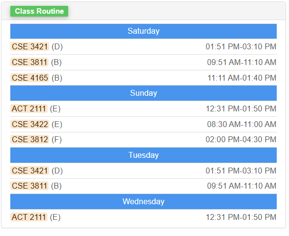
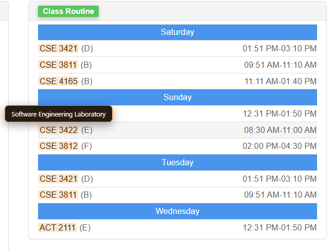
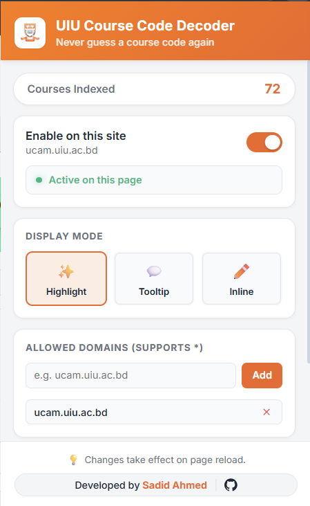
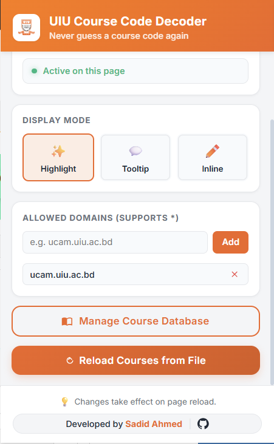
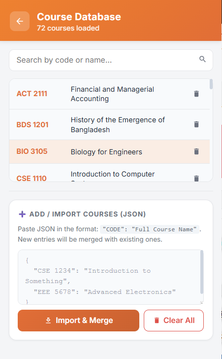
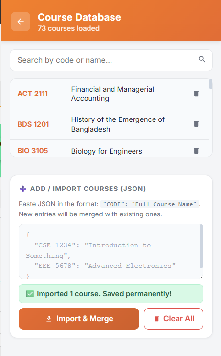

<div align="center">

# 🎓 UIU Course Code Decoder

*Decode course codes into full course names instantly on any webpage!*

[](#)
[](#)
[](https://opensource.org/licenses/MIT)

</div>

---

Welcome to **UIU Course Code Decoder**! Are you tired of staring at abstract course codes like `CSE 3421` and trying to remember if it's "Database Management Systems" or something else? We've got you covered.

This lightweight, privacy-focused Chrome extension automatically replaces course codes with their full names on any webpage. While built with United International University (UIU) students in mind, it is entirely customizable for any university, department, or personal schedule.

## 📑 Table of Contents

- [Features](#-features)
- [Installation](#-installation)
- [How to Use](#-how-to-use)
- [Configuration](#-configuration)
- [Troubleshooting & FAQ](#-troubleshooting--faq)
- [Privacy](#-privacy)
- [Contributing](#-contributing)
- [License](#-license)

---

## ✨ Features

- **🪄 Automatic Decoding:** Instantly decodes course codes on the pages you visit.
- **🧠 Smart Parsing:** Seamlessly handles course codes split across multiple lines, missing spaces, or broken by HTML tags.
- **🖼️ Iframe Support:** Works flawlessly inside embedded pages, such as Google Sheets routines!
- **🎨 Multiple Display Modes:** Choose exactly how you want to see the course names:
  - **Inline:** Adds the full name in parentheses next to the code.
  - **Tooltip:** Hover over the code to see the name in a neat tooltip.
  - **Highlight:** Highlights the code — hover to see the full name.
- **📚 Built-in Course Manager:** Manage everything right from the extension popup. Browse, search, and delete courses without opening new tabs.
- **💾 Persistent Custom Courses:** Import your own courses via JSON. Your custom additions are saved separately and won't be overwritten.
- **✅ Smart Allowlist:** You have full control. The extension only runs on the websites you specifically allow.
- **📊 Chart-Safe:** Automatically skips SVG elements so it won't break your Highcharts or other visual data elements.
- **🔒 100% Private:** Runs entirely locally in your browser. No tracking, no data collection.

---

## 🚀 Installation

You can install the extension directly from the Chrome Web Store or manually via Developer Mode.

### Method 1: Chrome Web Store (Coming Soon!)
1. Go to the **Chrome Web Store Link** *(Pending release)*
2. Click **"Add to Chrome"**.
3. Confirm the installation and you are good to go!

### Method 2: Manual Installation (Developer Mode)
If you want to try the latest version now:

1. **Download the Extension:**
   - Go to the [Releases page](https://github.com/litch07/uiu-course-decoder/releases) and download the latest `.zip` file.
   - Extract the `.zip` file to a folder on your computer.

2. **Open Chrome Extensions Page:**
   - In Chrome, navigate to `chrome://extensions/` in your address bar.

3. **Enable Developer Mode:**
   - Turn on the **Developer mode** toggle in the top right corner.

4. **Load the Extension:**
   - Click the **"Load unpacked"** button in the top left.
   - Select the folder where you extracted the extension files.

The extension is now installed and ready to use! 🎉

---

## 🎮 How to Use

  
*Course codes highlighted inline!*

  
*Hover over the course code to see its name!*

1. **Enable on a Website:**
   - Visit a website where you want course codes decoded (like your routine sheet).
   - Click the extension icon in your Chrome toolbar.
   - Toggle **"Enable on this site"** to ON. The page will reload and start decoding!

2. **Change Display Mode:**
   - Click the extension icon.
   - Under "Display Mode", choose **Highlight** ✨, **Tooltip** 💬, or **Inline** ✏️.

---

## ⚙️ Configuration

The extension provides a clean popup dashboard to manage your courses.

<p align="center">
  
   
</p>

### Adding and Managing Courses
1. Click the extension icon and select **"Manage Course Database"**.
2. From the sliding panel, you can search, edit, or delete existing courses.
3. **Add Custom Courses:** Look for the **"Add / Import Courses (JSON)"** section at the bottom.
4. Paste your course list in JSON format and click **"Import & Merge"**:

```json
{
  "CSE 3421": "Database Management Systems",
  "CSE 1111": "Structured Programming Language",
  "MATH 2183": "Calculus and Linear Algebra"
}
```

<p align="center">
  
  
</p>

*Courses are instantly merged and saved permanently! The active page will automatically refresh to show your new decodings.*

---

## ❓ Troubleshooting & FAQ

**Q: The extension isn't changing the course codes on a page.**
- **A:** Make sure you have enabled the extension for that specific website (click the icon → toggle ON).

**Q: It's not working inside an embedded Google Sheet or Document.**
- **A:** Some embedded documents use "iframes". The extension supports iframes — just make sure the parent domain is in your allowlist.

**Q: Will it break charts or graphs on my university portal?**
- **A:** No! The extension intentionally skips SVG elements to avoid breaking charts (like Highcharts) and other visual data elements.

**Q: I pasted JSON but my courses didn't update.**
- **A:** Make sure your JSON is a valid, flat object (all keys and values in double quotes). A red error message will show if the format is incorrect.

**Q: Will I lose my custom courses if I reload the file?**
- **A:** No! Custom courses are saved in a separate persistent storage layer. They will survive updates and automatically merge with the default list.

---

## 🔒 Privacy

Your privacy is our priority. All settings and course lists are saved directly in your browser's local storage. **We do not track you, collect data, or send any information to external servers.** Read our complete [Privacy Policy](PRIVACY.md) for more details.

---

## 🤝 Contributing

We welcome contributions! Whether you're fixing a bug, adding a feature, or just improving the documentation, your help is deeply appreciated. 

Please see our [Contributing Guidelines](CONTRIBUTING.md) for full details on how to get started, create a branch, and open a Pull Request. If you find a bug or have a suggestion, please [open an issue](https://github.com/litch07/uiu-course-decoder/issues).

---

## 📄 License

This project is licensed under the MIT License - see the [LICENSE](LICENSE) file for details.
